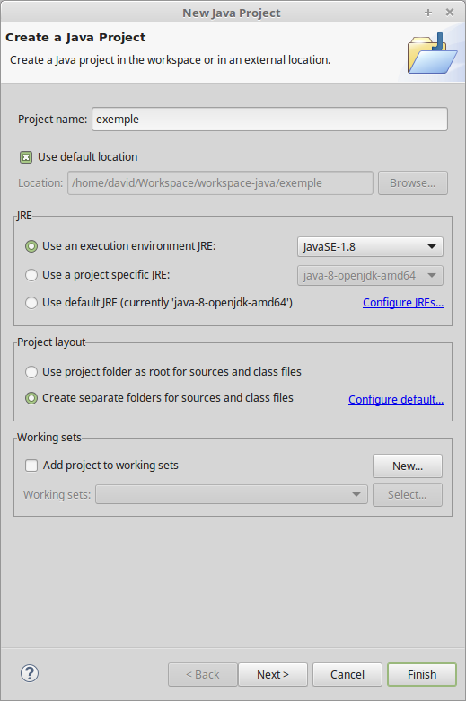

Compilation & exécution
#######################
Dans ce chapitre, nous n'allons pas directement nous intéresser au langage Java.
Nous allons plutôt essayer de comprendre les mécanismes sous-jacents à la compilation et à l'exécution
d'un programme Java. Nous verrons également comment créer un projet dans Eclipse.

Un premier programme
********************

Nous allons utiliser comme exemple la programme Java suivant :

.. literalinclude:: samples/PremierProgramme.java

La syntaxe du langage nous importe peu pour l'instant. Ce programme Java va simplement écrire
le message "Hello World!" sur la sortie standard.

Téléchargez le fichier :download:`PremierProgramme.java <samples/PremierProgramme.java>`
contenant ce code.

La compilation
**************

Pour pouvoir exécuter ce programme, nous allons devoir le compiler. Pour cela,
nous devons utiliser le programme javac_ (Java Compiler) dont c'est la fonction.
Dans un terminal, il suffit de se rendre dans le répertoire où se situe le fichier
et de lancer la commande de compilation :

.. code-block:: shell

  $ cd /home/david/Workspace/workspace-java/exemple
  $ javac PremierProgramme.java

.. attention::
  Si votre système ne connaît pas la commande javac_ cela signifie simplement
  que le répertoire contenant ce programme n'est pas déclaré dans le chemin d'exécution
  du système. Il vous suffit de le rajouter ou de donner le chemin complet menant à
  ce programme. Par exemple :

  .. code-block:: shell

    $ /opt/bin/jdk1.8/bin/javac PremierProgramme.java

  Le programme javac_ est installé dans le sous-répertoire **bin** du répertoire
  d'installation du JDK

La compilation devrait se passer sans problème et aboutir à la création du fichier
**PremierProgramme.class** dans le même répertoire que le fichier java.

.. note::
  Nous y reviendrons plus tard mais en Java, nous déclarons des classes (parfois un peu spéciales).
  Un fichier source porte l'extension **java** et contient le code source d'une classe. Un fichier
  résultant de la compilation porte le même nom que le fichier source mais avec l'extension **class**.
  Ce fichier n'est pas directement éditable car il contient des instructions en bytecode compréhensibles
  par la JVM.

L'exécution
***********

L'exécution d'un programme se fait par l'intermédiaire de la machine virtuelle. Pour invoquer cette
dernière, on utilise tout simplement la commande java_ suivie du nom de la classe **sans l'extension** :

.. code-block:: shell

  $ java PremierProgramme

.. attention::
  Si votre système ne connaît pas la commande java_ cela signifie simplement
  que le répertoire contenant ce programme n'est pas déclaré dans le chemin d'exécution
  du système. Il vous suffit de le rajouter ou de donner le chemin complet menant à
  ce programme. Par exemple :

  .. code-block:: shell

    $ /opt/bin/jdk1.8/bin/java PremierProgramme

  Le programme java_ est installé dans le sous-répertoire **bin** du répertoire
  d'installation du JDK

La commande java_ va chercher le fichier PremierProgramme.class pour l'exécuter.
Cela signifie qu'à ce stade, vous n'êtes pas obligé de disposer du fichier source
PremierProgramme.java.

La liaison dynamique
********************
Tous les langages de programmation évolués utilisent la notion de liaison (**link**).
En effet, il est nécessaire à un moment donné de pouvoir créer un programme à partir
de plusieurs fichiers source. Généralement, les fichiers source sont compilés un à un
puis un mécanisme de liaison permet de gérer les dépendances entre chacun des fichiers.
En programmation, on distingue la liaison **statique** et la liaison **dynamique**.

La liaison statique est une étape qui intervient après la compilation et qui permet
de regrouper l'ensemble des fichiers compilés dans un fichier exécutable unique. Les langages
tels que C et C++ supportent la liaison statique.

La liaison dynamique est une étape qui intervient au moment du lancement du programme.
On vérifie que les fichiers compilés sont disponibles pour l'exécution.

Java ne supporte que la liaison dynamique. Cela signifie que chaque fichier compilé
donnera un fichier class. Cela signifie également qu'un programme Java est en fait
une collection de plusieurs fichiers class.

Si votre programme est dépendant d'une bibliothèque tierce en Java, vous devez également fournir
les fichiers de cette bibliothèque au moment de l'exécution.

.. note::
  Il est impossible d'écrire un programme Java qui n'ait aucune dépendance avec d'autres
  fichiers class. Dans notre exemple, même simple, nous sommes dépendants de la classe
  **System**. Nous sommes même dépendants de la classe **Object** alors que ce mot
  n'est pas présent dans le fichier source. Heureusement, ces classes font partie
  de la bibliothèque standard de Java qui est disponible avec l'environnement d'exécution.
  Nous n'avons donc pas à nous préoccuper de comment la JVM va trouver le code pour
  ces classes. Mais elle le fera bel et bien en utilisant le mécanisme de liaison
  dynamique.

Le classpath
************

La liaison dynamique implique qu'un programme Java est une collection de fichiers.
Ces fichiers peuvent se trouver à différents endroits dans le système de fichiers.
Il faut donc un mécanisme pour permettre de les localiser. En Java, on utilise
le **classpath** : le chemin des classes. On peut par exemple spécifier un
ou plusieurs chemins avec le paramètre **-classpath** aux commandes java_ et javac_
indiquant les répertoires à partir desquels il est possible de trouver des fichiers
class.

.. code-block:: shell

  $ java -classpath /home/david/Workspace/workspace-java/exemple PremierProgramme

La commande ci-dessus peut être exécutée à partir de n'importe quel répertoire
puisqu'elle précise un classpath. La JVM tentera de chercher un fichier PremierProgramme.class
dans le répertoire */home/david/Workspace/workspace-java/exemple*.

S'il existe des répertoires contenant des fichiers class que vous utilisez souvent,
vous pouvez les inclure implicitement dans le classpath on déclarant ces répertoires
dans la variable d'environnement **CLASSPATH**.

.. code-block:: shell

  $ export CLASSPATH=/home/david/Workspace/workspace-java/exemple
  $ java PremierProgramme

.. note::
  Même si le principe du classpath est simple, cela peut amener à des situations
  très complexes dans les projets. Si on indique plusieurs chemins, on peut avoir
  des répertoires utilisés comme classpath contenant des classes avec des nom identiques
  mais avec des comportements différents. On peut aussi exécuter à son insu du code malicieux.
  Depuis Java 9, un nouveau système baptisé *Jigsaw* et basé sur la notion de module a fait son apparition.
  Mais il faudra certainement plusieurs années avant que ce système ne remplace
  définitivement le mécanisme du classpath.

Bibliothèques Java : les fichiers JAR
*************************************
Si on se rappelle qu'un programme Java est une collection de fichiers class et qu'il n'est pas rare
qu'un programme ait besoin de centaines voire de milliers de ces fichiers alors on se rend vite
compte qu'il n'est pas très facile de distribuer un programme Java sous cette forme.

Pour palier à ce problème, on peut utiliser des fichiers jar. JAR signifie *Java ARchive* :
il s'agit d'un fichier zip contenant un ensemble de fichiers class mais qui a l'extension **.jar**.
Java fournit l'utilitaire jar_ pour créer une archive :

.. code-block:: shell

  $ jar -cf monappli.jar PremierProgramme.class

L'utilitaire jar_ reprend la syntaxe de **tar** sous les systèmes \*NIX.

Un fichier JAR peut être ajouté au classpath rendant ainsi disponible l'ensemble
des fichiers qu'il contient.

.. code-block:: shell

  $ export CLASSPATH=/home/david/Workspace/workspace-java/exemple/monappli.jar
  $ java PremierProgramme

C'est un moyen simple de distribuer son code. Toutes les bibliothèques tierces
Java sont disponibles sous la forme d'un fichier JAR.

Création d'un projet dans Eclipse
*********************************
Il est utile de comprendre le fonctionnement des outils tels que java_ ou javac_
mais ils ne sont pas d'une utilisation très aisée pour de vrais projets. On
préférera utiliser un outil de build comme Ant_, Maven_ ou Gradle_ pour automatiser
la compilation et un environnement de développement intégré comme Eclipse_
pour le développement.

Eclipse fournit des avantages précieux pour les développeurs. Notamment :

* Eclipse compile automatiquement les fichiers lorsqu'ils sont sauvés. Il est donc
  possible d'avoir immédiatement un retour sur les éventuelles erreurs de syntaxe ou autres.
* Eclipse offre un environnement riche pour manipuler et modifier les fichiers sources.

Quelques raccourcis clavier utiles dans Eclipse :

.. csv-table:: Raccourcis clavier

  "CTRL + espace", "Complétion de code"
  "CTRL + 1 (ou CTRL + SHIFT + 1)", "Suggestions"
  "SHIFT + ALT + R", "Renommer dans tous les fichiers"
  "MAJ + CTRL + F", "Reformater le code"
  "MAJ + CTRL + O", "Organiser les imports"
  "CTRL + SHIFT + T", "Chercher le fichier d'une classe"
  "CTRL + SHIFT + R", "Chercher une ressource (un fichier)"
  "F11", "Exécuter la classe courante"

On peut créer toutes sortes de projets différents dans Eclipse. Pour nous, le plus
utile sera bien sûr le projet Java. Pour cela, il suffit d'aller dans le menu
*File > New > Java Project*. On obtient alors la boite de dialogue suivante :

Il suffit de donner le nom du projet et de cliquer sur *Finish*. Il se peut qu'Eclipse
ouvre ensuite une boîte de dialogue pour vous demander si vous voulez changer de
*perspective*. Dans Eclipse, une perspective est un agencement de l'espace de travail
adapté pour certaines tâches. Il existe par exemple une perspective Java adaptée
pour développer du code Java et une perspective Debug pour le debuggage du code.

Un fois le projet créé, on voit que Eclipse a ajouté automatiquement un répertoire **src**
destiné à accueillir les sources du projet. Il suffit d'ajouter le fichier
:download:`PremierProgramme.java <samples/PremierProgramme.java>` à cet endroit.

Comme indiqué ci-dessus, toute modification dans ce fichier entraînera automatiquement
sa compilation au moment de la sauvegarde.

Si l'on souhaite distribuer son projet, on peut, par exemple, produire un fichier JAR.
Pour cela, il suffit de faire un clic droit sur le nom du projet dans le *Package Explorer*
et de choisir *Export*. Dans la boîte de dialogue d'export, il faut chercher "jar" et sélectionner
*Java > JAR File*. En cliquant sur *Next*, on spécifie le nom et l'emplacement du fichier JAR
et il sera créé en cliquant sur *Finish*.

Exercice
********

.. admonition:: Utilisation de bibliothèques JAR
    :class: hint

    Pour cet exercice, nous allons créer un document PDF grâce à la bibliothèque
    iText_. Pour cela, téléchargez les fichiers JAR suivants :

    * http://central.maven.org/maven2/com/itextpdf/itextpdf/5.5.12/itextpdf-5.5.12.jar
    * http://central.maven.org/maven2/org/bouncycastle/bcprov-jdk15on/1.58/bcprov-jdk15on-1.58.jar
    * http://central.maven.org/maven2/org/bouncycastle/bcpkix-jdk15on/1.58/bcpkix-jdk15on-1.58.jar

    Créez une projet Java dans Eclipse et copiez les fichiers JAR téléchargés dans
    un répertoire *lib* que vous créerez dans le projet Eclipse.

    Ajoutez maintenant les fichiers JAR comme bibliothèques du projet. Pour cela,
    faites une clic droit sur le nom du projet dans le *Package Explorer* et choisissez
    *Properties*. Dans la boite de dialogue des propriétés du projet, choisissez
    *Java Buid Path* et enfin cliquez sur l'onglet *Libraries*. Utilisez le bouton
    *Add JARs...* pour déclarer les fichiers téléchargés comme des bibliothèques
    de votre projet.

    .. image:: images/eclipse_build_path.png

    .. tip::

      Dans le *Package Explorer*, vous pouvez directement faire un clic droit
      sur chaque fichier JAR et choisir *Build Path > Add to Build Path*.

    Créer ensuite la classe *PremierPdf* et ajoutez le code suivant :

    ::

      import java.io.FileOutputStream;

      import com.itextpdf.text.Document;
      import com.itextpdf.text.Paragraph;
      import com.itextpdf.text.pdf.PdfWriter;

      public class PremierPdf {

        public static void main(String[] args) throws Exception {
          Document document = new Document();
          PdfWriter.getInstance(document, new FileOutputStream("premier-pdf.pdf"));
          document.open();
          document.addTitle("Mon premier PDF");
          document.add(new Paragraph("Hello the world en PDF grâce à iText"));
          document.close();
        }
      }

    En exécutant cette classe, vous obtenez à la racine de votre projet le fichier
    *premier-pdf.pdf* créé grâce à la bibliothèque iText_.

    .. tip::

      Si vous ne voyez pas le fichier PDF apparaître dans le *Package Explorer*,
      faites un clic droit sur le nom du projet et choisissez *Refresh*.

    .. note::

      Pour cet exercice , les fichiers JAR sont téléchargés depuis le site
      http://central.maven.org qui référence des milliers de bibliothèques Java.
      Maven_ est un outil de *build* qui permet de gérer les étapes de construction
      de votre projet et notamment de déclarer les dépendances logicielles.

.. _javac: https://docs.oracle.com/javase/8/docs/technotes/tools/windows/javac.html
.. _java: https://docs.oracle.com/javase/8/docs/technotes/tools/windows/java.html
.. _jar: https://docs.oracle.com/javase/8/docs/technotes/tools/windows/jar.html
.. _Ant: http://ant.apache.org
.. _Maven: http://maven.apache.org
.. _Gradle: https://gradle.org
.. _Eclipse: https://eclipse.org
.. _iText: https://itextpdf.com/
