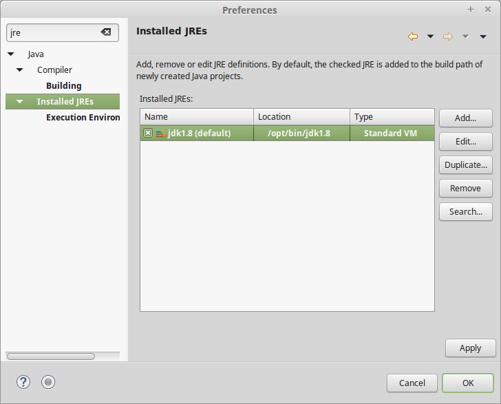

Installation
############
Pour suivre ce cours, vous aurez besoin d'un environnement de développement Java.
Rendez vous sur le `site d'Oracle`_ afin de télécharger le **JDK** (Java Development Kit)
compatible pour votre machine.

L'installation du JDK dépend de votre plate-forme : il est distribué sous la forme d'un installeur
pour Windows et MacOS, et sous la forme d'un package ou d'une archive sous Linux.

.. attention::

  Votre machine dispose déjà très certainement d'un environnement d'exécution
  Java (**JRE**) qui ne contient pas les outils nécessaires pour développer en Java. Vous
  devez donc installer un JDK

.. topic:: Téléchargement du JDK

  http://www.oracle.com/technetwork/java/javase/downloads/index.html

Vous aurez également besoin d'un environnement de développement intégré (**IDE**) pour Java.
Il en existe plusieurs. Dans le cadre de cette formation, nous utiliserons Eclipse_

Il existe plusieurs *packaging* d'Eclipse visant des publics différents. Si vous voulez
uniquement faire du développement d'application Java, vous pouvez télécharger
le package *Eclipse IDE for Java Developers*. Si par contre, vous voulez réaliser des
développement d'application Web alors peut-être devriez-vous télécharger le package
*Eclipse IDE for Java EE Developers*. Cette dernière version offre des fonctionnalités
supplémentaires pour le développement d'applications serveur.

Eclipse est distribué sous la forme d'une archive (tar.gz pour Linux et MacOS et zip pour Windows)
que vous pouvez décompresser où vous le souhaitez.

.. topic:: Téléchargement de l'IDE Eclipse

  https://www.eclipse.org/downloads/eclipse-packages/

Configuration d'Eclipse
***********************

Après avoir lancé Eclipse, il va falloir vérifier la version de Java utilisée par l'IDE
et la modifier si nécessaire.

Pour vérifier les versions de Java disponibles dans Eclipse, ouvrez les préférences
utilisateur : menu "Window > Preferences". Dans la zone de filtre en haut à gauche,
saisissez "jre" (pour Java Runtime Environment) et sélectionnez dans l'arbre
"Installed JREs" comme ci-dessous :

Vérifiez que le JDK que vous avez installé se trouve bien dans la liste des JRE détectés
par Eclipse. De plus le JDK doit être coché pour indiquer à Eclipse qu'il s'agit de
l'environnement d'exécution à utiliser par défaut pour tous les projets.

Si vous ne trouvez pas le JDK installé dans la liste, utilisez le bouton "Add..."
pour l'ajouter manuellement :

1. Pour le choix du type de JRE, choisissez "Standard VM" et cliquez sur "Next"
2. Dans la boîte de dialogue "Add JRE", cliquez sur le bouton "Directory..." pour sélectionner le répertoire d'installation du JDK
3. Eclipse s'occupe ensuite de remplir les champs nécessaires et vous n'avez plus qu'à cliquer sur "Finish"

.. image:: images/eclipse_jre_definition.png

.. attention::

  N'oubliez pas de cocher la ligne de votre JDK dans l'écran "Installed JREs" pour
  qu'il devienne l'environnement d'exécution par défaut.

.. _site d'Oracle: http://www.oracle.com/technetwork/java/javase/downloads/index.html
.. _Eclipse: https://www.eclipse.org
