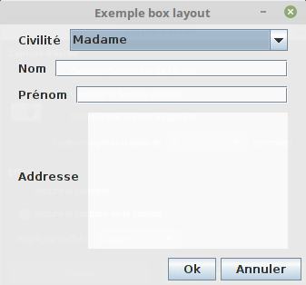
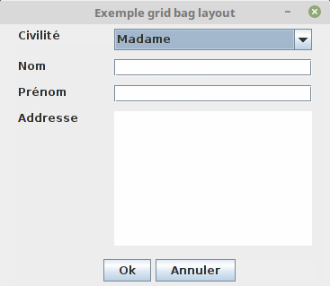
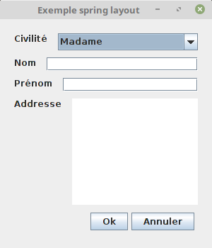

Swing : les interfaces graphiques
#################################

Ce chapitre est une introduction au développement d'application graphique en
Java à l'aide de la bibliothèque Swing.

Swing permet de développer des applications graphiques portables en Java. Cela
signifie que ces applications fonctionneront de manière identique quels que soient
le système d'exploitation et l'environnement graphique utilisé. Swing a été conçu
plus spécifiquement pour créer des applications pour ordinateur de bureau (*desktop environment*).
Il est composé d'un ensemble de classes qui se trouvent dans le package
javax.swing_ ainsi que dans ses sous-packages.

.. note::

  Depuis Java 8, Swing n'est plus la bibliothèque de référence pour créer des
  applications graphiques : elle a été remplacée par JavaFX_. Néanmoins, Swing
  reste encore largement connu et donc utilisé par les développeurs.

  Swing a lui-même remplacé une bibliothèque Java plus ancienne nommé AWT
  (*Abstract Window Toolkit*). Cette dernière offrait un accès en Java à l'API
  graphique du système alors que Swing offre des composants graphiques totalement
  implémentés en Java (et donc avec un comportement et un rendu identiques
  quel que soit le système sous-jacent). AWT est toujours présent dans la bibliothèque
  standard de Java et ses classes se trouvent dans le package java.awt_.
  Swing utilise une partie des classes fournies par AWT.

Une première application
************************

Dans une interface graphique, le composant graphique fondamental est la fenêtre.
Une fenêtre dispose généralement d'une barre de titre, un cadre et éventuellement
une barre de menu et une barre d'état. Dans Swing, une fenêtre correspond à la
classe JFrame_.

.. code-block:: java
  :linenos:

  package ROOT_PKG.gui;

  import javax.swing.JFrame;
  import javax.swing.JLabel;
  import javax.swing.WindowConstants;

  public class HelloWorld {

    public static void main(String[] args) {
      JFrame window = new JFrame("Première appli");
      window.add(new JLabel("Hello world!"));
      window.setSize(300,100);
      window.setLocation(100, 100);
      window.setDefaultCloseOperation(WindowConstants.EXIT_ON_CLOSE);
      window.setVisible(true);
    }
  }

Le code ci-dessus crée une fenêtre dans laquelle est écrit "Hello world!".

* ligne 10 : création d'une instance de JFrame_ qui représente la fenêtre principale
  (et unique) pour cette application. Le paramètre de constructeur indique le
  titre à afficher dans la barre de titre.
* ligne 11 : on ajoute un composant graphique de type JLabel_ qui correspond à un
  libellé.
* ligne 12 : on indique la dimension en pixels de la fenêtre (largeur puis hauteur)
* ligne 13 : on indique la position à l'écran de la fenêtre. La position est donnée
  en pixels depuis le bord supérieur gauche de l'écran.
* ligne 14 : on spécifie une opération par défaut lorsque la fenêtre est fermée
  par l'utilisateur (par exemple lorsqu'il clique sur le bouton *fermer* de
  la barre de titre). Pour cet exemple, on indique la constante *EXIT_ON_CLOSE*
  qui indique que le programme doit s'arrêter lorsque cette fenêtre est fermée.
* ligne 15 : on rend la fenêtre visible, ce qui déclenche son affichage.

Une chose peut paraître surprenante : après la ligne 15, le programme ci-dessus
ne fait plus rien, la méthode *main* se termine et donc le programme devrait
s'arrêter. Mais il n'en est rien. Si vous exécutez ce code, une fenêtre s'affiche
et le programme continue de s'exécuter tant que la fenêtre n'est pas fermée. En
fait la méthode *main* se termine effectivement mais comme la fenêtre a été rendue
visible à la ligne 15, cela a déclenché la boucle des événements Swing (*event loop*).
La boucle des événements est une boucle qui s'exécute dans un processus
léger (*thread*). Elle traite continuellement les événements que reçoit l'application graphique. Par
exemple, si l'utilisateur appuie sur une touche du clavier ou bouge la souris,
la boucle des événements en est alertée et crée des objets pour représenter
ces événements. Pour les exemples données, il s'agira d'instances de
KeyEvent_ et de MouseEvent_. Tant que la boucle des événements s'exécute, l'application
ne peut pas s'arrêter (même si toutes les fenêtres de l'application ont été fermées).
C'est pour cela qu'à la ligne 14, on précise que si la fenêtre est fermée, alors
il faudra déclencher un événement de sortie (*EXIT_ON_CLOSE*) qui mettra fin à
boucle des événements et arrêtera l'application.

Les principaux composants
*************************

Les composants graphiques Swing sont conçus comme des conteneurs. D'ailleurs,
ils héritent indirectement de la classe AWT Container_. Cela signifie qu'une
instance de JFrame_ (une fenêtre) contient des composants graphiques qui eux-mêmes
peuvent contenir des composants graphiques, etc, etc. Donc on peut imaginer
une interface graphique sous la forme d'un arbre dont la racine est constituée
par une instance de JFrame_. Pour ajouter un composant graphique dans un autre
composant graphique, on peut utiliser une des méthodes add_ héritées de Container_.
On peut également supprimer un composant d'un autre avec la méthode Container.remove_
ou Container.removeAll_.

Parmi les composants graphiques les plus couramment utilisés en Swing, on trouve :

JPanel_
  Ce composant a une représentation graphique vide (à l'exception d'une couleur de fond).
  Il sert soit à grouper des composants dans une arborescence de composants graphiques
  soit comme classe parente pour créer un composant graphique plus élaboré.

JLabel_
  Ce composant représente une zone de texte ou une image à afficher. Généralement, il est utilisé
  pour afficher des textes cours. Une instance de JLabel_ ne réagit pas aux événements
  (notamment de type clavier). Il est conçu pour fournir un libellé ou une icône
  pour un champ de saisi (d'où son nom).

JTextField_
  Ce composant représente une champ texte éditable par l'utilisateur.

JTextArea_
  Ce composant représente une zone de texte éditable par l'utilisateur. Le JTextArea_
  est plus adapté que le JTextField_ lorsqu'on veut représenter du texte sur plusieurs
  lignes.

JEditorPane_
  Ce composant correspond à un éditeur de texte riche. Il peut afficher du texte
  avec des informations de formatage (comme des balises). Par défaut, il supporte
  le texte brut (*text/plain*), le HTML (*text/html*) et le RTF (*text/rtf*).

JCheckBox_
  Ce composant correspond à une case à cocher.

JRadioButton_
  Ce composant représente un bouton radio.

JComboBox_
  Ce composant fait apparaître une liste de choix que l'utilisateur peut sélectionner.
  La JComboBox_ supporte la sélection unique ou la multi sélection.

JProgressBar_
  Ce composant dessine une barre de progression.

JButton_
  Ce composant représente un bouton.

JSeparator_
  Ce composant affiche un trait pour marquer une séparation entre deux composants

JSpinner_
  Ce composant affiche une boite de saisie avec deux flèches (une vers le haut et
  une vers le bas). Il s'agit le plus souvent d'afficher un nombre et de donner
  la possibilité à l'utilisateur d'incrémenter ou de décrémenter ce nombre en cliquant
  sur les flèches.

JTabbedPane_
  Ce composant permet d'afficher plusieurs onglets. Chaque onglet contient un
  composant Swing.

.. code-block:: java
  :linenos:

  package ROOT_PKG.gui;

  import javax.swing.JButton;
  import javax.swing.JCheckBox;
  import javax.swing.JComboBox;
  import javax.swing.JComponent;
  import javax.swing.JEditorPane;
  import javax.swing.JFrame;
  import javax.swing.JLabel;
  import javax.swing.JPanel;
  import javax.swing.JProgressBar;
  import javax.swing.JSpinner;
  import javax.swing.JTabbedPane;
  import javax.swing.JTextArea;
  import javax.swing.UIManager;
  import javax.swing.WindowConstants;

  public class ExempleComposant extends JFrame {

    private JTabbedPane tabbedPane;

    @Override
    protected void frameInit() {
      super.frameInit();
      this.setDefaultCloseOperation(WindowConstants.EXIT_ON_CLOSE);
      this.setName("Exemple composants");
      tabbedPane = new JTabbedPane();
      this.add(tabbedPane);

      addComponent("Label",
                   new JLabel(UIManager.getIcon("FileView.computerIcon")),
                   new JLabel("Libellé avec du texte"));

      addComponent("Text field", new JTextArea("champ de texte"));
      addComponent("Text area", new JTextArea("zone de texte"));
      addComponent("Combo box", new JComboBox<String>(new String[] {"Bleu", "Rouge", "Vert"}));
      addComponent("Check box", new JCheckBox("une boite à cocher"));
      addComponent("Spinner", new JSpinner());
      addComponent("Editor", new JEditorPane("text/html", "
Un éditeur de texte <strong>riche</strong>
"));
      JProgressBar progressBar = new JProgressBar();
      progressBar.setValue(60);
      addComponent("Progress bar", progressBar);
      addComponent("Button", new JButton("Un bouton"));
    }

    private void addComponent(String titre, JComponent... components) {
        JPanel panel = new JPanel();
        for (JComponent component : components) {
          panel.add(component);
        }
        tabbedPane.add(titre, panel);
    }

    public static void main(String[] args) {
      JFrame window = new ExempleComposant();
      window.setSize(500, 400);
      window.setLocationRelativeTo(null);
      window.setVisible(true);
    }

  }

Le programme ci-dessus présente un exemple d'affichage des principaux composants
graphiques. Il définit la classe *ExempleComposant* qui hérite de JFrame_. Il
s'agit d'un méthode assez courante pour créer des applications graphiques avec
Swing. On crée un nouveau composant qui hérite de JFrame_ pour jouer le rôle
d'une fenêtre dans notre application. Ce composant redéfinit la méthode
JFrame.frameInit_ (à partir de la ligne 23) qui lui permet d'effectuer toutes les opérations d'initialisation.
Dans notre cas, il s'agit de créer une instance de JTabbedPane_, puis de créer
un exemple de chaque composant et de l'ajouter dans le *tabbedPane* grâce à la
méthode privée *addComponent* déclarée à la ligne 46. Notez que les composants
ne sont pas directement ajoutés au *tabbedPane* mais à une instance de JPanel_
qui est ajoutée au *tabbedPane*.

.. note::

  À la ligne 57, on appelle la méthode Window.setLocationRelativeTo_ qui permet
  de positionner une fenêtre à la même position qu'un autre composant graphique.
  En passant **null** comme paramètre, cela positionne la fenêtre au centre
  de l'écran.

.. _swing_layout:

Les layouts
***********

Lorsqu'on ajoute plusieurs composants graphiques dans un conteneur, on souhaite
organiser visuellement ces composants d'une certaine manière. Par exemple, pour
un formulaire de saisie, on souhaite afficher ligne par ligne un champ libellé
avec son champ de texte de saisie. Si le conteneur graphique change de taille
(parce que la fenêtre change de dimension ou parce que les autres composants
autour du conteneur changent), on souhaite que le contenu conserve une cohérence
dans son organisation. Un type d'agencement est appelé un *layout* et il existe
en Swing des objets qui représentent des types de *layout* particulier.

Chaque composant Swing a une taille préférée (une hauteur et une largeur en
pixels) qui est donnée par la méthode Container.getPreferredSize_. Par exemple, une
instance de JButton_ va donner une taille qui lui permet d'afficher correctement
son libellé ainsi que le dessin qui représente le cadre du bouton lui-même. Un
*layout* doit tenir compte de la taille préférée de tous les composants dont
il a la charge. Swing fournit huit *layouts* différents : BorderLayout_,
BoxLayout_, CardLayout_, FlowLayout_, GridBagLayout_, GroupLayout_, GridLayout_,
SpringLayout_.

.. note::

  Les sections ci-dessous ne couvrent pas tous les *layouts*. Vous pouvez
  vous reporter au guide officiel :
  https://docs.oracle.com/javase/tutorial/uiswing/layout/visual.html

Le BoxLayout
============

Le BoxLayout_ permet d'organiser les composants selon l'axe de la page (*PAGE_AXIS*),
c'est-à-dire verticalement ou selon l'axe de la ligne (*LINE_AXIS*), c'est-à-dire
horizontalement.

.. code-block:: java
  :linenos:

  package ROOT_PKG.gui;

  import java.awt.FlowLayout;

  import javax.swing.BorderFactory;
  import javax.swing.Box;
  import javax.swing.BoxLayout;
  import javax.swing.JButton;
  import javax.swing.JComboBox;
  import javax.swing.JComponent;
  import javax.swing.JFrame;
  import javax.swing.JLabel;
  import javax.swing.JPanel;
  import javax.swing.JTextArea;
  import javax.swing.JTextField;
  import javax.swing.WindowConstants;

  public class ExempleBoxLayout extends JFrame {

    @Override
    protected void frameInit() {
      super.frameInit();
      this.setDefaultCloseOperation(WindowConstants.EXIT_ON_CLOSE);
      this.setName("Exemple box layout");
      this.getContentPane().setLayout(new BoxLayout(this.getContentPane(), BoxLayout.PAGE_AXIS));

      addRow("Civilité", new JComboBox<String>(new String[] {"Madame", "Monsieur"}));
      addRow("Nom", new JTextField());
      addRow("Prénom", new JTextField());
      addRow("Addresse", new JTextArea(10, 20));
      addButtons(new JButton("Ok"), new JButton("Annuler"));
      this.pack();
      this.setResizable(false);
    }

    private void addRow(String titre, JComponent... components) {
        JPanel panel = new JPanel();
        panel.setLayout(new BoxLayout(panel, BoxLayout.LINE_AXIS));
        panel.setBorder(BorderFactory.createEmptyBorder(5, 20, 5, 20));

        JLabel label = new JLabel(titre);
        label.setLabelFor(components[0]);
        panel.add(label);

        for (JComponent component : components) {
          panel.add(Box.createHorizontalStrut(10));
          panel.add(component);
        }
        this.add(panel);
    }

    private void addButtons(JButton...buttons) {
      FlowLayout flowLayout = new FlowLayout(FlowLayout.RIGHT);
      JPanel panel = new JPanel(flowLayout);
      for (JButton button : buttons) {
        panel.add(button);
      }
      this.add(panel);
    }

    public static void main(String[] args) {
      JFrame window = new ExempleBoxLayout();
      window.setLocationRelativeTo(null);
      window.setVisible(true);
    }

  }

Le programme ci-dessus produit une fenêtre de formulaire :

À la ligne 25, on ajoute une instance de BoxLayout_ comme *layout* dans le
*content pane*.

.. note::

  Un objet de type JFrame_ possède une hiérarchie de composants particulière.
  Comme il représente une fenêtre, il peut posséder une barre de menu, une barre
  de statut et une zone de contenu appelée le *content pane*. Lorsqu'on ajoute
  un composant dans une instance de JFrame_, on ajoute en fait le composant
  à son *content pane*. Si on veut modifier le type de *layout* de la fenêtre, il
  s'agit en fait du *layout* de sa zone centrale et donc du *content pane*.

La méthode *addRow* déclarée à la ligne 36 permet d'ajouter les lignes du
formulaire. Une ligne correspond à une instance de JPanel_ dont le *layout* est
géré par une instance de BoxLayout_. À la ligne 46, on crée une Box_ grâce à
la méthode **static** Box.createHorizontalStrut_. Cette boite permet de donner
un écart minimal en pixels entre deux composants.

La méthode *addButtons* déclarée à la ligne 52 permet de créer une ligne contenant
les boutons en bas du formulaire. Là encore, la ligne est représentée par un
JPanel_. Mais son *layout* est ici géré par une instance de FlowLayout_. Un
FlowLayout_ organise les composants les uns à la suite des autres en permettant
de spécifier un alignement. Pour notre application on demande que les boutons
soient alignés à droite (FlowLayout.Right_).

À la ligne 32, on appelle la méthode pack_. Comme son nom l'indique, cette méthode
compacte les dimensions du composant graphique afin que sa taille soit minimale. Appliquée
à notre classe qui représente la fenêtre de l'application, cette méthode force
les gestionnaires de *layout* à organiser visuellement les composants graphiques
pour qu'ils s'affichent correctement. Puis, à la ligne 33, on spécifie que la
fenêtre de l'application ne peut pas être redimensionnée.

.. _swingGridBagLayout:

Le GridBagLayout
================

Le GridBagLayout_ permet de gérer le *layout* comme une grille fictive. Chaque composant
a des contraintes de positionnement. Ces contraintes sont
représentées par les attributs d'une instance de GridBagConstraints_ :

gridx, gridy
  Ces attributs indiquent la position dans la grille (colonne et ligne).

gridwidth, gridheight
  Ces attributs indiquent si le composant s'étend sur plusieurs
  cases (horizontalement et verticalement) de la grille.

weightx, weighty
 Ces attributs donnent le poids du composant : c'est-à-dire le pourcentage de
 l'espace qu'il occupe par comparaison aux autres à l'horizontal et à la verticale.

fill
  Cet attribut indique comment le composant remplit la case dans laquelle il se
  trouve.

.. code-block:: java
  :linenos:

  package ROOT_PKG.gui;

  import java.awt.GridBagConstraints;
  import java.awt.GridBagLayout;
  import java.awt.Insets;

  import javax.swing.JButton;
  import javax.swing.JComboBox;
  import javax.swing.JComponent;
  import javax.swing.JFrame;
  import javax.swing.JLabel;
  import javax.swing.JPanel;
  import javax.swing.JTextArea;
  import javax.swing.JTextField;
  import javax.swing.WindowConstants;

  public class ExempleGridBagLayout extends JFrame {

    @Override
    protected void frameInit() {
      super.frameInit();
      this.setDefaultCloseOperation(WindowConstants.EXIT_ON_CLOSE);
      this.setTitle("Exemple grid bag layout");
      this.getContentPane().setLayout(new GridBagLayout());

      int rowIndex = 0;
      addRow(rowIndex++, "Civilité", new JComboBox<String>(new String[] {"Madame", "Monsieur"}));
      addRow(rowIndex++, "Nom", new JTextField());
      addRow(rowIndex++, "Prénom", new JTextField());
      addRow(rowIndex++, "Addresse", new JTextArea(10, 20));
      addButtons(rowIndex++, new JButton("Ok"), new JButton("Annuler"));
      this.pack();
      this.setResizable(false);
    }

    private void addRow(int rowIndex, String titre, JComponent component) {
      // création des contraintes de positionnement
      GridBagConstraints cst = new GridBagConstraints();
      // le composant doit occuper tout l'espace horizontal de sa case
      cst.fill = GridBagConstraints.HORIZONTAL;
      // le composant doit être aligné sur le haut de la case
      cst.anchor = GridBagConstraints.NORTH;
      // on définit la marge en pixels pour le haut, la gauche, le bas et la droite
      cst.insets = new Insets(5, 20, 5, 20);
      // on définit la position verticale
      cst.gridy = rowIndex;
      // on définit la position horizontale
      cst.gridx = 0;
      // poids relatif à l'horizontal
      cst.weightx = .3;

      JLabel label = new JLabel(titre);
      label.setLabelFor(component);
      this.add(label, cst);

      // on définit la position horizontale
      cst.gridx = 1;
      // poids relatif à l'horizontal
      cst.weightx = .7;
      this.add(component, cst);
    }

    private void addButtons(int rowIndex, JButton...buttons) {
      JPanel panel = new JPanel();
      for (JButton button : buttons) {
        panel.add(button);
      }
      // création des contraintes de positionnement
      GridBagConstraints cst = new GridBagConstraints();
      // on définit la marge en pixels pour le haut, la gauche, le bas et la droite
      cst.insets = new Insets(5, 10, 0, 0);
      // le composant doit occuper tout l'espace horizontal de sa case
      cst.fill = GridBagConstraints.HORIZONTAL;
      // on définit la position verticale
      cst.gridy = rowIndex;
      // on définit la position horizontale
      cst.gridx = 0;
      // le composant s'étend à l'horizontal sur deux cases de la grille
      cst.gridwidth = 2;
      this.add(panel, cst);
    }

    public static void main(String[] args) {
      JFrame window = new ExempleGridBagLayout();
      window.setLocationRelativeTo(null);
      window.setVisible(true);
    }

  }

Le programme ci-dessus produit une fenêtre de formulaire :

À la ligne 24, on spécifie le GridBagLayout_ comme *layout* pour le *content pane*.
Aux lignes 38 et 69, chaque méthode de création des composants crée une instance
de GridBagConstraints de manière à spécifier les contraintes de placement qui
sont ensuite passées en paramètres au moment de l'ajout des composants aux lignes
60 et 80.

Le GridBagLayout_ est particulièrement utile pour des fenêtres de type formulaire
qui sont le plus souvent organisées par rapport à une grille. Il évite d'avoir à créer
des objets de type JPanel_ pour grouper les composants entre eux.

Le SpringLayout
===============

Le SpringLayout_ offre la plus grande liberté pour définir un *layout*. Les composants
sont simplement ajoutés au conteneur utilisant ce gestionnaire de *layout*. Puis,
on déclare des contraintes spatiales entre les composants ou entre les composants
et le conteneur.

.. code-block:: java
  :linenos:

  package ROOT_PKG.gui;

  import java.awt.Container;

  import javax.swing.JButton;
  import javax.swing.JComboBox;
  import javax.swing.JComponent;
  import javax.swing.JFrame;
  import javax.swing.JLabel;
  import javax.swing.JPanel;
  import javax.swing.JTextArea;
  import javax.swing.JTextField;
  import javax.swing.SpringLayout;
  import javax.swing.WindowConstants;

  public class ExempleSpringLayout extends JFrame {

    private SpringLayout springLayout;

    @Override
    protected void frameInit() {
      super.frameInit();
      this.setDefaultCloseOperation(WindowConstants.EXIT_ON_CLOSE);
      this.setTitle("Exemple spring layout");
      springLayout = new SpringLayout();
      this.getContentPane().setLayout(springLayout);

      Container container = addRow(null, "Civilité", new JComboBox<String>(new String[] {"Madame", "Monsieur"}));
      container = addRow(container, "Nom", new JTextField());
      container = addRow(container, "Prénom", new JTextField());
      container = addRow(container, "Addresse", new JTextArea(10, 20));
      addButtons(new JButton("Ok"), new JButton("Annuler"));
      this.setSize(300,350);
    }

    private Container addRow(Container topContainer, String titre, JComponent component) {
        JLabel label = new JLabel(titre);
        label.setLabelFor(component);
        this.add(label);
        // Un libellé est à 20px du bord gauche
        springLayout.putConstraint(SpringLayout.WEST, label, 20, SpringLayout.WEST, this.getContentPane());
        if (topContainer == null) {
          // Un libellé est à 20px du bord du haut
          springLayout.putConstraint(SpringLayout.NORTH, label, 20, SpringLayout.NORTH, this.getContentPane());
        } else {
          // Un libellé est à 10px de la ligne du dessus
          springLayout.putConstraint(SpringLayout.NORTH, label, 10, SpringLayout.SOUTH, topContainer);
        }

        // Un composant est à 15px du libellé
        springLayout.putConstraint(SpringLayout.WEST, component, 15, SpringLayout.EAST, label);
        // Un composant est à 20px du bord droit
        springLayout.putConstraint(SpringLayout.EAST, component, -20, SpringLayout.EAST, this.getContentPane());
        if (topContainer == null) {
          // Un composant est à 20px du bord du haut
          springLayout.putConstraint(SpringLayout.NORTH, component, 20, SpringLayout.NORTH, this.getContentPane());
        } else {
          // Un composant est à 10px de la ligne du dessus
          springLayout.putConstraint(SpringLayout.NORTH, component, 10, SpringLayout.SOUTH, topContainer);
        }
        this.add(component);
        return component;
    }

    private void addButtons(JButton...buttons) {
      JPanel panel = new JPanel();
      for (JButton button : buttons) {
        panel.add(button);
      }
      this.add(panel);
      // La barre des boutons est à 20px du bord droit
      springLayout.putConstraint(SpringLayout.SOUTH, panel, -20, SpringLayout.SOUTH, this.getContentPane());
      // La barre des boutons est à 20px du bas
      springLayout.putConstraint(SpringLayout.EAST, panel, -20, SpringLayout.EAST, this.getContentPane());
    }

    public static void main(String[] args) {
      JFrame window = new ExempleSpringLayout();
      window.setLocationRelativeTo(null);
      window.setVisible(true);
    }

  }

Le programme ci-dessus produit une fenêtre de formulaire :

Le look & feel
**************

Avec Swing, les composants graphiques manipulés par une application ne sont
pas directement responsables de leur représentation à l'écran. Il est possible de
modifier l'aspect général (le *look and feel*) d'une application sans changer
significativement l'implémentation. Par défaut,
Swing utilise un *look and feel* identique sur toutes les plates-formes. Mais
il est possible de demander d'utiliser un rendu qui corresponde plus à celui
de l'environnement graphique de l'utilisateur ou même de fournir un *look
and feel* personnalisé.

.. code-block:: java
  :linenos:

  package ROOT_PKG.gui;

  import javax.swing.JButton;
  import javax.swing.JCheckBox;
  import javax.swing.JComboBox;
  import javax.swing.JComponent;
  import javax.swing.JEditorPane;
  import javax.swing.JFrame;
  import javax.swing.JLabel;
  import javax.swing.JPanel;
  import javax.swing.JProgressBar;
  import javax.swing.JSpinner;
  import javax.swing.JTabbedPane;
  import javax.swing.JTextArea;
  import javax.swing.UIManager;
  import javax.swing.WindowConstants;

  public class ExempleComposant extends JFrame {

    private JTabbedPane tabbedPane;

    @Override
    protected void frameInit() {
      super.frameInit();
      this.setDefaultCloseOperation(WindowConstants.EXIT_ON_CLOSE);
      this.setName("Exemple composants");
      tabbedPane = new JTabbedPane();
      this.add(tabbedPane);

      addComponent("Label",
                   new JLabel(UIManager.getIcon("FileView.computerIcon")),
                   new JLabel("Libellé avec du texte"));

      addComponent("Text field", new JTextArea("champ de texte"));
      addComponent("Text area", new JTextArea("zone de texte"));
      addComponent("Combo box", new JComboBox<String>(new String[] {"Bleu", "Rouge", "Vert"}));
      addComponent("Check box", new JCheckBox("une boite à cocher"));
      addComponent("Spinner", new JSpinner());
      addComponent("Editor", new JEditorPane("text/html", "
Un éditeur de texte <strong>riche</strong>
"));
      JProgressBar progressBar = new JProgressBar();
      progressBar.setValue(60);
      addComponent("Progress bar", progressBar);
      addComponent("Button", new JButton("Un bouton"));
    }

    private void addComponent(String titre, JComponent... components) {
        JPanel panel = new JPanel();
        for (JComponent component : components) {
          panel.add(component);
        }
        tabbedPane.add(titre, panel);
    }

    public static void main(String[] args) {
      try {
        UIManager.setLookAndFeel(UIManager.getSystemLookAndFeelClassName());
      } catch (Exception e) {
        e.printStackTrace();
      }
      JFrame window = new ExempleComposant();
      window.setSize(500, 400);
      window.setLocationRelativeTo(null);
      window.setVisible(true);
    }

  }

L'exemple ci-dessus reprend l'application qui affiche différents composants
graphiques. La seule différence se situe des lignes 55 à 59. Avant de créer
la fenêtre principale, on utilise la classe UIManager_ pour sélectionner le
*look and feel* correspondant au système sur lequel l'application s'exécute.

Exercice
********

.. admonition:: Application pour éditer les données personnelles
  :class: hint

  **Objectif**
    Créez une application Swing qui permet de saisir les informations personnelles
    d'un utilisateur. Cette application ne permet pas (encore) de sauvegarder ni de charger
    des données. Les champs à saisir sont :

    * Le titre : Monsieur, Madame, Docteur, Professeur ou rien (utilisez une liste déroulante)
    * Le prénom
    * Le nom
    * L'émail
    * Le numéro de téléphone
    * L'adresse : rue, code postal, ville
    * La date de naissance

    Pour la saisie de la date de naissance, utilisez le composant graphique
    JDatePicker_ disponible avec la dépendance Maven :

    .. code-block:: xml

      <dependency>
        <groupId>io.github.lzh0379</groupId>
        <artifactId>jdatepicker</artifactId>
        <version>2.0.3</version>
      </dependency>

    On peut ensuite créer un ``JDatePicker`` et utiliser la méthode ``getModel()``
    pour positionner ou récupérer la date :

    ::

      JDatePicker jDatePicker = new JDatePicker(Calendar.getInstance());
      System.out.println(jDatePicker.getModel().getDay());
      System.out.println(jDatePicker.getModel().getMonth());
      System.out.println(jDatePicker.getModel().getYear());
      System.out.println(jDatePicker.getModel().getValue());

    Un ``JDatePicker`` est un composant Swing qui peut être ajouté dans un JFrame_,
    un JPanel_ ou n'importe quel composant graphique Swing.

  **Modèle Maven du projet à télécharger**
    :download:`swing-template.zip <assets/templates/swing-template.zip>`

  **Mise en place du projet**
    Éditer le fichier :file:`pom.xml` du template et modifier la balise
    artifactId pour spécifier le nom de votre projet.

.. _JavaFX: https://docs.oracle.com/javase/8/javase-clienttechnologies.htm
.. _javax.swing: https://docs.oracle.com/javase/8/docs/api/javax/swing/package-summary.html
.. _java.awt: https://docs.oracle.com/javase/8/docs/api/java/awt/package-summary.html
.. _JFrame: https://docs.oracle.com/javase/8/docs/api/javax/swing/JFrame.html
.. _JLabel: https://docs.oracle.com/javase/8/docs/api/javax/swing/JLabel.html
.. _JPanel: https://docs.oracle.com/javase/8/docs/api/javax/swing/JPanel.html
.. _JTextField: https://docs.oracle.com/javase/8/docs/api/javax/swing/JTextField.html
.. _JTextArea: https://docs.oracle.com/javase/8/docs/api/javax/swing/JTextArea.html
.. _JCheckBox: https://docs.oracle.com/javase/8/docs/api/javax/swing/JCheckBox.html
.. _JRadioButton: https://docs.oracle.com/javase/8/docs/api/javax/swing/JRadioButton.html
.. _JComboBox: https://docs.oracle.com/javase/8/docs/api/javax/swing/JComboBox.html
.. _JProgressBar: https://docs.oracle.com/javase/8/docs/api/javax/swing/JProgressBar.html
.. _JButton: https://docs.oracle.com/javase/8/docs/api/javax/swing/JButton.html
.. _JSeparator: https://docs.oracle.com/javase/8/docs/api/javax/swing/JSeparator.html
.. _JSpinner: https://docs.oracle.com/javase/8/docs/api/javax/swing/JSpinner.html
.. _JTabbedPane: https://docs.oracle.com/javase/8/docs/api/javax/swing/JTabbedPane.html
.. _JEditorPane: https://docs.oracle.com/javase/8/docs/api/javax/swing/JEditorPane.html
.. _BoxLayout: https://docs.oracle.com/javase/8/docs/api/javax/swing/BoxLayout.html
.. _BorderLayout: https://docs.oracle.com/javase/8/docs/api/java/awt/BorderLayout.html
.. _CardLayout: https://docs.oracle.com/javase/8/docs/api/java/awt/CardLayout.html
.. _FlowLayout: https://docs.oracle.com/javase/8/docs/api/java/awt/FlowLayout.html
.. _GridBagLayout: https://docs.oracle.com/javase/8/docs/api/java/awt/GridBagLayout.html
.. _GridLayout: https://docs.oracle.com/javase/8/docs/api/java/awt/GridLayout.html
.. _GroupLayout: https://docs.oracle.com/javase/8/docs/api/javax/swing/GroupLayout.html
.. _SpringLayout: https://docs.oracle.com/javase/8/docs/api/javax/swing/SpringLayout.html
.. _KeyEvent: https://docs.oracle.com/javase/8/docs/api/java/awt/event/KeyEvent.html
.. _MouseEvent: https://docs.oracle.com/javase/8/docs/api/java/awt/event/MouseEvent.html
.. _Container: https://docs.oracle.com/javase/8/docs/api/java/awt/Container.html
.. _add: https://docs.oracle.com/javase/8/docs/api/java/awt/Container.html#add-java.awt.Component-
.. _Container.add: https://docs.oracle.com/javase/8/docs/api/java/awt/Container.html#add-java.awt.Component-
.. _Container.remove: https://docs.oracle.com/javase/8/docs/api/java/awt/Container.html#remove-java.awt.Component-
.. _Container.removeAll: https://docs.oracle.com/javase/8/docs/api/java/awt/Container.html#removeAll--
.. _JFrame.frameInit: https://docs.oracle.com/javase/8/docs/api/javax/swing/JFrame.html#frameInit--
.. _window.setLocationRelativeTo: https://docs.oracle.com/javase/8/docs/api/java/awt/Window.html#setLocationRelativeTo-java.awt.Component-
.. _Container.getPreferredSize: https://docs.oracle.com/javase/8/docs/api/java/awt/Container.html#getPreferredSize--
.. _Box: https://docs.oracle.com/javase/8/docs/api/javax/swing/Box.html
.. _Box.createHorizontalStrut: https://docs.oracle.com/javase/8/docs/api/javax/swing/Box.html#createHorizontalStrut-int-
.. _GridBagConstraints: https://docs.oracle.com/javase/8/docs/api/java/awt/GridBagConstraints.html
.. _FlowLayout.RIGHT: https://docs.oracle.com/javase/8/docs/api/java/awt/FlowLayout.html#RIGHT
.. _UIManager: https://docs.oracle.com/javase/8/docs/api/javax/swing/UIManager.html
.. _pack: https://docs.oracle.com/javase/8/docs/api/java/awt/Window.html#pack--
.. _JDatePicker: https://jdatepicker.org/
