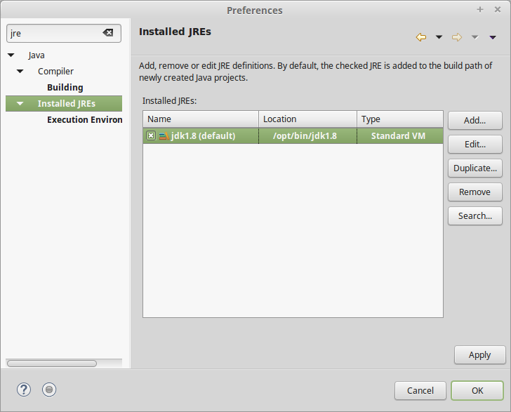
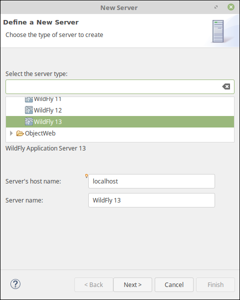
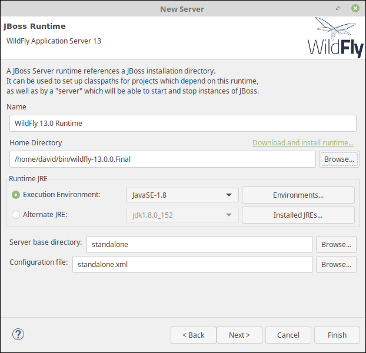
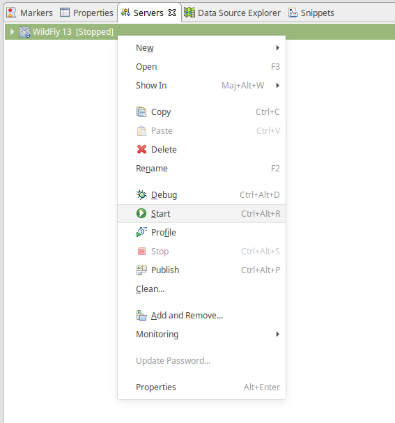

L'environnement de développement
################################

L'objectif de ce chapitre est **la mise en place de
l'environnement de développement** pour réaliser les développements
d'applications Java EE pour le Web.

Pour cela, vous aurez au moins besoin :

-  du kit Java de développement
-  d'un environnement de développement : par exemple Eclipse
-  d'un conteneur de Servlet Java EE

Téléchargement des outils
*************************

La liste des outils requis est :

**Java 8 JDK**
    | Le kit de développement Java 8
    | http://www.oracle.com/technetwork/java/javase/downloads/jdk8-downloads-2133151.html

.. admonition:: JRE ou JDK ?

    Il existe deux distributions de Java par Oracle : JRE (Java Runtime
    Edition) et le JDK (Java development kit). Le JRE permet uniquement
    l'exécution des programmes Java. Le JDK fournit en plus un
    compilateur et des outils utiles aux développeurs. Il est donc
    nécessaire d'installer le JDK pour développer des applications en
    Java mais également pour exécuter le serveur TomEE.

**Eclipse IDE for Java EE Web Developpers**
    | L'environnement de développement
    | http://www.eclipse.org/downloads/packages/eclipse-ide-java-ee-developers/oxygen3a

    Il existe plusieurs distributions d'Eclipse. Il est impératif
    d'installer **la version pour le développement Java EE**. Si vous
    avez déjà installé Eclipse, vérifiez dans le menu "Help > About
    Eclipse" que votre version est bien "Eclipse Java EE IDE for Web
    Developers".

**Tomcat**
    | Le conteneur de servlet Tomcat
    | Windows : http://www-eu.apache.org/dist/tomcat/tomcat-9/v9.0.10/bin/apache-tomcat-9.0.10.zip
    | MacOS et Linux : http://www-eu.apache.org/dist/tomcat/tomcat-9/v9.0.10/bin/apache-tomcat-9.0.10.tar.gz

    Nous verrons bientôt que les applications Java pour le Web ne sont pas des
    programmes indépendants (standalone). Les applications Java EE sont
    déployées et exécutées dans ce que l'on appelle un serveur
    d'application qui fournit l'environnement d'exécution nécessaire. Tomcat
    n'est pas à proprement parlé un serveur d'application car il n'offre qu'un
    nombre de services limités par rapport à un serveur d'application normal.
    Néanmoins, il est très souvent utilisé en production par les entreprise
    pour réaliser des application Web en Java.

Installation des outils
***********************

L'installation du JDK dépend de votre plate-forme : il est distribué
sous la forme d'un installeur pour Windows et MacOS, et sous la forme
d'un package ou d'une archive sous Linux.

Eclipse et Tomcat sont distribués sous la forme d'une archive (tar.gz
pour Linux et MacOS et zip pour Windows) que vous pouvez décompresser où
vous le souhaitez.

Configuration de Java dans Eclipse
**********************************

Après avoir lancé Eclipse, il va falloir vérifier la version de Java
utilisée par l'IDE et la modifier si nécessaire.

Pour vérifier les versions de Java disponibles dans Eclipse, ouvrez les
préférences utilisateur : menu :guilabel:`Window > Preferences`. Dans la zone de
filtre en haut à gauche, saisissez *jre* (pour Java Runtime Environment)
et sélectionnez dans l'arbre :guilabel:`Installed JREs` comme ci-dessous :

|JRE installés dans Eclipse|

Vérifiez que le JDK que vous avez installé se trouve bien dans la liste
des JRE détectés par Eclipse. De plus le JDK doit être coché pour
indiquer à Eclipse qu'il s'agit de l'environnement d'exécution à
utiliser par défaut pour tous les projets.

**Si vous ne trouvez pas le JDK installé dans la liste**, utilisez le
bouton :guilabel:`Add...` pour l'ajouter manuellement :

#. Pour le choix du type de JRE, choisissez :guilabel:`Standard VM` et cliquez sur
   :guilabel:`Next`
#. Dans la boîte de dialogue :guilabel:`Add JRE`, cliquez sur le bouton
   :guilabel:`Directory...` pour sélectionner le répertoire d'installation du JDK
#. Eclipse s'occupe ensuite de remplir les champs nécessaires et vous
   n'avez plus qu'à cliquer sur :guilabel:`Finish`

|Définition d'une JRE dans Eclipse|

N'oubliez pas de cocher la ligne de votre JDK dans l'écran
:guilabel:`Installed JREs` pour qu'il devienne l'environnement d'exécution par défaut.

Intégration de Tomcat dans Eclipse
**********************************

Tomcat est un serveur Web qui peut être exécuté de manière autonome
(comme un serveur de production par exemple). Cependant, pour simplifier
les tâches de développement, nous allons l'intégrer dans Eclipse afin de
pouvoir le démarrer et l'arrêter directement depuis l'IDE.

Dans Eclipse Java EE, il existe une vue pour créer et gérer les
serveurs. Pour ajouter cette vue, il faut passer par le menu :guilabel:`Window >
Show View > Servers`.

Vous avez maintenant la vue "Servers" ajoutée à votre perspective de
développement. Faites un click droit dans cette vue pour sélectionner
:guilabel:`New > Server`.

Vous pouvez maintenant ajouter un serveur Tomcat 9 en sélectionnant
:guilabel:`Apache > Tomcat v9.0 Server`.

|Ajout d'un serveur dans Eclipse|

Cliquez ensuite sur :guilabel:`Next`.
Dans la boîte de dialogue :guilabel:`Tomcat Server`, il vous faut indiquer
l'emplacement du serveur sur votre disque. Pour cela, cliquez sur
:guilabel:`Browse...` pour sélectionner le répertoire d'installation
de Tomcat sur votre disque.

|Configuration d'un serveur dans Eclipse|

Cliquez ensuite sur :guilabel:`Finish`.

Vous disposez maintenant d'un serveur dans votre vue *Servers*. Il ne
vous reste plus qu'à le démarrer en faisant un click droit sur son nom
et en sélectionnant :guilabel:`Start`.

|Lancement du serveur dans Eclipse|

Si tout se passe bien, à la fin du lancement, vous pourrez accéder à
votre serveur à l'adresse http://localhost:8080. Vous devez voir
s'afficher une page d'erreur avec le libellé :

  État HTTP 404 – Not Found

En effet, le serveur ne contient encore aucune application Java Web à exécuter.
Mais le serveur est néanmoins démarré.

