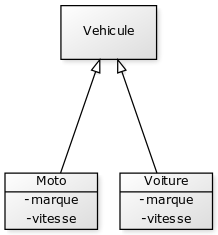
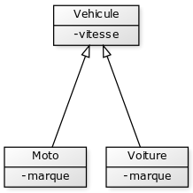
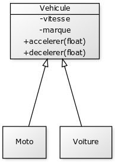

Les relations entre objets
##########################

Une application Java est composée d'un ensemble d'objets. Un des intérêts de la
programmation objet réside dans les relations que ces objets entretiennent les 
uns avec les autres. Ces relations sont construitent par les développeurs et
constituent ce que l'on appelle l'architecture d'une application. Il existe
deux relations fondamentales en programmation objet :

**est un** (*is-a*)
  Cette relation permet de créer une chaîne de relation d'identité entre des
  classes. Elle indique qu'une classe peut être assimilée à une autre classe 
  représentant une notion plus abstraite ou plus générale. 
  On parle plus couramment **d'héritage** pour désigner ce type de relation.
  
**a un** (*has-a*)
  Cette relation permet de créer une relation de dépendance d'une classe envers
  une autre. Une classe a besoin des services d'une autre classe pour réaliser
  sa fonction. On parle également de relation de **composition** pour désigner
  ce type de relation.

L'héritage
**********

Imaginons que nous voulions développer un simulateur de conduite. Nous pouvons
concevoir une classe *Voiture* qui sera la représentation d'une voiture dans
notre application.

::

  package ROOT_PKG.conduite;
  
  public class Voiture {
  
    private final String marque;
    private float vitesse;
    
    public Voiture(String marque) {
      this.marque = marque;
    }
    
    // ...
    
  }
  

Mais nous pouvons également rendre possible la simulation d'une moto. Dans ce
cas, nous aurons également besoin d'une classe *Moto*

::

  package ROOT_PKG.conduite;
  
  public class Moto {
  
    private final String marque;
    private float vitesse;
    
    public Moto(String marque) {
      this.marque = marque;
    }
    
    // ...
    
  }

On se rend vite compte qu'au stade de notre développement, une voiture et une
moto représentent la même chose. Faut-il alors créer deux classes
différentes ? En programmation objet, il n'y a pas de réponse toute faite à cette
question. Mais si notre application gère, par exemple, le type de permis de 
conduire, il serait judicieux d'avoir des représentations différentes pour ces 
types de véhicule car ils nécessitent des permis de conduire différents.
Si mon application de simulation permet de faire se déplacer des objets
de ces classes, alors il va peut-être falloir autoriser les objets de type
*Voiture* à aller en marche arrière mais pas les objets de type *Moto*. Bref,
comme souvent en programmation objet, on se retrouve avec des classes qui ont
des notions en commun (dans notre exemple, la vitesse et la marque), tout en ayant 
leurs propres spécificités.

Dans ce type de relations, nous pouvons utiliser l'héritage pour faire apparaître
une classe réprésentant une notion plus générale ou abstraite. Dans notre
exemple, il pourrait s'agir de la classe *Vehicule*. Les classes *Voiture* et
*Moto* peuvent hériter de cette nouvelle classe puiqu'une voiture **est un**
véhicule et une moto **est un** véhicule.

En Java, l'héritage est indiqué par le mot clé **extends** après le nom de la
classe. On dit donc qu'une classe en *étend* une autre.

::

  package ROOT_PKG.conduite;
  
  public class Vehicule {
  
    // ...
    
  }

::

  package ROOT_PKG.conduite;
  
  public class Voiture extends Vehicule {
  
    private final String marque;
    private float vitesse;
    
    public Voiture(String marque) {
      this.marque = marque;
    }
    
    // ...
    
  }

::

  package ROOT_PKG.conduite;
  
  public class Moto extends Vehicule {
  
    private final String marque;
    private float vitesse;
    
    public Moto(String marque) {
      this.marque = marque;
    }
    
    // ...
    
  }

Le terme d'héritage vient du fait qu'une classe qui en étend une autre *hérite*
de la définition de sa classe parente et notamment de ses attributs et de ses
méthodes. Par exemple, les classes *Voiture* et *Moto* ont en commun la déclaration
de l'attribut *vitesse*. Cet attribut semble donc faire partie de l'abstraction 
commune de *Vehicule*.

::

  package ROOT_PKG.conduite;
  
  public class Vehicule {
  
    private float vitesse;

    // ...
    
  }

::

  package ROOT_PKG.conduite;
  
  public class Voiture extends Vehicule {
  
    private final String marque;
    
    public Voiture(String marque) {
      this.marque = marque;
    }
    
    // ...
    
  }

::

  package ROOT_PKG.conduite;
  
  public class Moto extends Vehicule {
  
    private final String marque;
    
    public Moto(String marque) {
      this.marque = marque;
    }
    
    // ...
    
  }
  
Il est maintenant possible d'ajouter les méthodes *accelerer* et *decelerer* à 
la classe Vehicule et les classes *Voiture* et *Moto* en hériteront.

::

  package ROOT_PKG.conduite;
  
  public class Vehicule {
  
    private float vitesse;
    
    public void accelerer(float deltaVitesse) {
      this.vitesse += deltaVitesse;
    }

    public void decelerer(float deltaVitesse) {
      this.vitesse -= deltaVitesse;
    }

    // ...
    
  }

Tous les véhicules de cette application peuvent maintenant accélérer et décélérer.

::

  package ROOT_PKG.conduite;

  public class AppliSimple {

    public static void main(String[] args) {
      Voiture voiture = new Voiture("DeLorean");
      voiture.accelerer(88);

      Moto moto = new Moto("Kaneda");
      moto.accelerer(120);
    }

  }
  

Héritage et constructeur
************************

Dans notre exemple précédent, l'attribut *marque* pourrait tout aussi bien être
mutualisé dans la classe *Vehicule*. Cependant, La présence des constructeurs de
*Voiture* et *Moto* permettent une initialisation de cet attribut à partir du 
paramètre.

En Java, nous avons vu qu'un constructeur peut en appeler un autre déclaré dans
la même classe grâce au mot-clé *this*. De la même manière, un constructeur
peut appeler un constructeur de sa classe parente grâce au mot-clé *super*.
Il doit respecter les mêmes contraintes :

* Un constructeur ne peut appeler qu'un constructeur.
* L'appel au constructeur doit être la première instruction du constructeur.

Il est donc possible de déclarer un constructeur dans la classe *Vehicule* et
appeler ce constructeur depuis les constructeurs de *Voiture* et *Moto*.

::

  package ROOT_PKG.conduite;
  
  public class Vehicule {

    private final String marque;
    private float vitesse;
    
    public Vehicule(String marque) {
      this.marque = marque;
    }
    
    public void accelerer(float deltaVitesse) {
      this.vitesse += deltaVitesse;
    }

    public void decelerer(float deltaVitesse) {
      this.vitesse -= deltaVitesse;
    }

    // ...
    
  }

::

  package ROOT_PKG.conduite;
  
  public class Voiture extends Vehicule {
  
    public Voiture(String marque) {
      super(marque);
    }
    
    // ...
    
  }

::

  package ROOT_PKG.conduite;
  
  public class Moto extends Vehicule {
  
    public Moto(String marque) {
      super(marque);
    }
    
    // ...
    
  }

*Voiture* et *Moto* peuvent maintenant proposer leurs propres méthodes et attributs
tout en ayant les mêmes méthodes et attributs que la classe *Vehicule*.

En java, si votre constructeur n'appelle aucun constructeur, alors le compilateur
génèrera une instruction d'appel au constructeur sans paramètre de la classe parente.

Si vous créez la classe suivante :

::

  package ROOT_PKG.simple.test
  
  public class MaClasse {
  
    public MaClasse() {
    }
  
  }

Le compilateur génèrera le bytecode correspondant au code suivant :

::

  package ROOT_PKG.simple.test
  
  public class MaClasse extends Object {
  
    public MaClasse() {
      super()
    }
  
  }

Si vous omettez d'appeler un constructeur, alors le compilateur part du principe
qu'il en existe un de disponible dans la classe parente et que ce constructeur 
ne prend pas de paramètre. Ainsi, Java garantit qu'un constructeur de la classe
parente est toujours appelé avant l'excution du constructeur courant. Cela signifie
que, lors de la création d'un objet, on commence toujours par initialiser la
classe la plus haute dans la hiérarchie d'héritage.

Ce qui peut sembler surprenant dans l'exemple précédent est que la classe 
*MaClasse* ne déclare pas de classe parente mais que le compilateur va forcer 
un héritage.

Héritage simple : Object
************************

Java ne supporte pas l'héritage multiple. Soit le développeur déclare avec
le mot-clé **extends** une seule classe parente, soit le compilateur part
du principe que la classe hérite de la classe Object_. Il n'est donc pas possible
en Java de disposer d'une classe qui n'hériterait de rien. L'arbre d'héritage
en Java ne possède qu'une seule classe racine : la classe Object_.

.. note ::

  C'est La classe Object_ qui déclare notamment les méthodes toString_ et equals_.
  Voilà pourquoi tous les objets Java peuvent avoir par défaut une représentation
  sous forme de chaîne de caractères et qu'ils peuvent être comparés aux autres.
  

Héritage des méthodes et attributs de classe
********************************************

Comme leur nom l'indique les méthodes et les attributs de classe appartiennent
à un classe.
  

Héritage et affectation
***********************

L'héritage introduit la notion de transitivité entre la classe enfant et la classe
parente. Une classe enfant a son propre type mais partage également le même type
que sa classe parente.

Pour notre exemple, cela signifie que l'on peut affecter à une variable de type
*Vehicule*, une instance de *Voiture* ou une instance de *Moto* :

::

  Vehicule vehicule = null;
  vehicule = new Voiture("DeLorean");
  vehicule = new Moto("Kaneda");
  
Cette possibilité introduit une abstraction importante dans la programmation
objet. Si une partie d'un programme peut 

.. note::

  héritage des attributs et méthodes de classe

  portée protected
  affectation & Principe de substitution de Liskov
  instanceof (downcasting, upcasting)
  open/close principle
  final
  
  composition
  choix entre composition & héritage

.. _Object: https://docs.oracle.com/javase/8/docs/api/java/lang/Object.html
.. _toString: https://docs.oracle.com/javase/8/docs/api/java/lang/Object.html#toString--
.. _equals: https://docs.oracle.com/javase/8/docs/api/java/lang/Object.html#equals-java.lang.Object-

