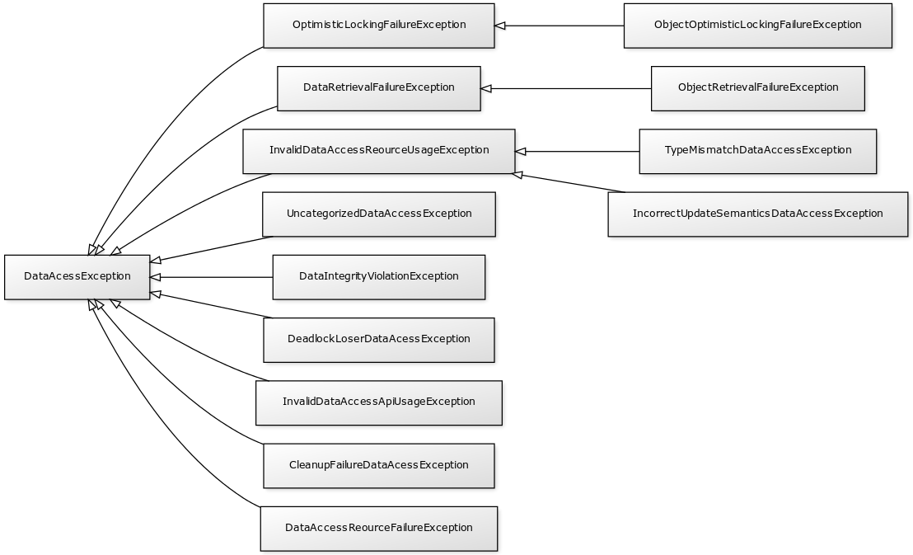

Spring DAO
##########

DAO (*Data Access Object*) est une responsabilité qui est souvent utilisée dans
les applications d'entreprise. Dans le code source d'une application, on peut
trouver des classes nommées ``UserDao``, ``ProducDao``... Ce suffixe "Dao" dénote
que la classe a pour responsabilité d'accéder au système d'information pour lire
ou modifier des données. Comme la plupart des applications d'entreprise stockent
leurs données dans une base de données, les classes DAO sont donc les classes
qui contiennent le code qui permet d'échanger des informations avec la base de données.
En Java, selon la technologie utilisée, il peut s'agir des classes qui utilisent
l'API JDBC ou JPA par exemple.

Le module *Spring Data Access* reprend ce principe d'architecture en cherchant à simplifier l'intégration
et l'implémentation des interactions avec les bases de données.

L'annotation @Repository
************************

Le Spring Framework fournit des stéréotypes pour marquer le rôle des classes.
Le stéréotype le plus général est défini par l'annotation `@Component`_.
Il est également possible d'utiliser l'annotation `@Repository`_ pour indiquer qu'une
classe sert de point d'accès à un mécanisme de stockage et de recherche d'une
collection d'objets. La notion de *repository* vient de l'ouvrage de Eric
Evans (*Domain Driven Development*).

::


  package {{ROOT_PKG}};


  import org.springframework.stereotype.Repository;

  @Repository
  public class UserDao {

    public void save(User user) {
      // ...
    }

    public User getById(long id) {
      // ...
    }

  }

Intégration de JPA
******************

Pour une application utilisant JPA et qui accepte la 
:ref:`configuration par annotations <spring_configuration_annotations>`, il est
possible d'injecter un EntityManager_ dans un *repository* grâce à l'annotation
`@Autowired`_, `@Inject`_ et même `@PersistenceContext`_ (qui est l'annotation
standard de Java EE).

.. code-block:: java
  :caption: Injection d'un EntityManager dans une classe repository


  package {{ROOT_PKG}};


  import javax.persistence.EntityManager;
  import javax.persistence.PersistenceContext;

  import org.springframework.stereotype.Repository;

  @Repository
  public class UserDao {

    @PersistenceContext
    private EntityManager entityManager;

    public void save(User user) {
      // ...
    }

    public User getById(long id) {
      // ...
    }

  }

.. note::

  Pour activer JPA, il faut configurer le contexte d'application avec
  :ref:`un gestionnaire de transaction JPA <spring_tx_transaction_jpa>`.

Uniformité de la hiérarchie des exceptions
******************************************

Un apport du module *Spring Data Access* est d'uniformiser la hiérarchie des exceptions.
En effet, l'API JDBC utilise des exceptions héritant
de SQLException_ qui est une *checked* exception. JPA utilise des *unechecked*
exceptions héritant de PersistenceException_. D'autres bibliothèques ou 
*frameworks* proposent à leur tour leur propre hiérarchie d'exceptions.

Pour simplifier la gestion des exceptions, *Spring Data Access* propose une
hiérarchie unique d'exceptions pour toutes ces technologies afin de simplifier
la gestion des erreurs pour les applications.

À la base de cette hiérarchie, la classe DataAccessException_ est une *unchecked* 
exception (elle hérite de RuntimeException_).

Pour une application utilisant JPA, l'uniformisation de la hiérarchie des exceptions
n'est pas activée par défaut. Pour l'activer, il faut utiliser l'annotation
`@Repository`_ et déclarer dans le contexte d'application un *bean* de type
PersistenceExceptionTranslationPostProcessor_.

.. code-block:: xml

  <bean class="org.springframework.dao.annotation.PersistenceExceptionTranslationPostProcessor" />

Accès aux données avec JDBC
***************************

*Spring Data Access* fournit la classe JdbcTemplate_ pour encapsuler les appels
JDBC. Cette classe est simplement une classe utilitaire qui réalise :

* la traduction d'une éventuelle SQLException_ dans la hiérarchie uniformisée des
  exceptions de *Spring Data Access*
* l'encapsulation des appels à Statement_ et PreparedStatement_
* une aide pour la création d'objets à partir d'un ResultSet_

.. note::

  Pour activer ce support avancé de JDBC, il faut ajouter comme dépendance Maven :
  
  .. code-block:: xml

    <dependency>
      <groupId>org.springframework</groupId>
      <artifactId>spring-jdbc</artifactId>
      <version>5.0.7.RELEASE</version>
    </dependency>

La classe JdbcTemplate_ se construit à partir d'une DataSource_. L'implémentation
recommandée est de créer une instance de JdbcTemplate_ au moment de l'injection
de la DataSource_ dans le *bean*. Ainsi, il est très simple de définir la DataSource_
dans le contexte de déploiement *Spring* de l'application (par JNDI, en utilisation un gestionnaire
de connexions comme DBCP_).

.. code-block:: java
  :caption: Un DAO utilisant une instance de JdbcTemplate
  

  package {{ROOT_PKG}};


  import javax.sql.DataSource;

  import org.springframework.beans.factory.annotation.Autowired;
  import org.springframework.jdbc.core.JdbcTemplate;
  import org.springframework.stereotype.Repository;

  @Repository
  public class UserDao {
    
    private JdbcTemplate jdbcTemplate;
    
    @Autowired
    public void setDataSource(DataSource dataSource) {
      this.jdbcTemplate = new JdbcTemplate(dataSource);
    }
    
    // ...

  }

.. note::
   
  L'implémentation de la classe JdbcTemplate_ est *thread-safe*. Cela signifie qu'elle
  peut être déclarée comme attribut d'un *bean singleton* utilisé dans un environnement
  concurrent (comme dans un serveur).

La classe JdbcTemplate_ permet d'exécuter des requêtes SQL de manière simplifiée.

.. code-block:: java
  :caption: Un exemple complet d'utilisation d'une instance de JdbcTemplate
  

  package {{ROOT_PKG}};


  import java.sql.ResultSet;
  import java.sql.SQLException;
  import java.util.List;

  import javax.sql.DataSource;

  import org.springframework.beans.factory.annotation.Autowired;
  import org.springframework.jdbc.core.JdbcTemplate;
  import org.springframework.jdbc.core.RowMapper;
  import org.springframework.stereotype.Repository;

  @Repository
  public class UserDao {

    private JdbcTemplate jdbcTemplate;

    @Autowired
    public void setDataSource(DataSource dataSource) {
      this.jdbcTemplate = new JdbcTemplate(dataSource);
    }

    public int getUserCount() {
      return jdbcTemplate.queryForObject("select count(1) from User", Integer.class);
    }

    public User getUserById(long id) {
      return jdbcTemplate.queryForObject("select * from User where id = ?", 
                                         new Object[] {id}, new UserRowMapper());
    }
    
    public List<User> getAll() {
      return jdbcTemplate.query("select * from User", new UserRowMapper());
    }

    private final class UserRowMapper implements RowMapper<User> {
      @Override
      public User mapRow(ResultSet rs, int rowNum) throws SQLException {
        User user = new User();
        user.setId(rs.getLong("id"));
        user.setNom(rs.getString("nom"));
        return user;
      }
    }

  }

Dans l'exemple ci-dessus, la classe interne ``UserRowMapper`` implémente
l'interface `RowMapper<T>`_ qui permet de transformer une ligne retournée par
un ResultSet_ en objet.

`Spring Data Access` fournit également la classe utilitaire SimpleJdbcInsert_
pour faciliter la génération de requête d'insertion :

.. code-block:: java
  :caption: Exemple d'utilisation de la classe SimpleJdbcInsert
  :linenos:


  package {{ROOT_PKG}};


  import java.util.HashMap;
  import java.util.Map;

  import javax.sql.DataSource;

  import org.springframework.beans.factory.annotation.Autowired;
  import org.springframework.jdbc.core.JdbcTemplate;
  import org.springframework.jdbc.core.simple.SimpleJdbcInsert;
  import org.springframework.stereotype.Repository;

  @Repository
  public class UserDao {

    private JdbcTemplate jdbcTemplate;
    private SimpleJdbcInsert simpleJdbcInsert;

    @Autowired
    public void setDataSource(DataSource dataSource) {
      this.jdbcTemplate = new JdbcTemplate(dataSource);
      this.simpleJdbcInsert = new SimpleJdbcInsert(dataSource).withTableName("User");
    }

    public void save(User user) {
      Map<String,Object> params = new HashMap<String, Object>();
      params.put("name", user.getName());

      simpleJdbcInsert.execute(params);
    }

    // ...
  }

À la ligne 22, on crée une instance de SimpleJdbcInsert_ en précisant le nom
de la table pour laquelle on souhaite générer des requêtes d'insertion. Aux
lignes 26-27, on crée un dictionnaire des valeurs à insérer et enfin, à la
ligne 29, on appelle la méthode ``execute`` en passant le dictionnaire
des paramètres. La méthode génère et exécute la requête SQL d'insertion.

Avec cette classe utilitaire, il est même possible de récupérer la clé
primaire générée (pour le cas d'une colonne *auto increment* avec MySQL
par exemple) :

.. code-block:: java
  :caption: Exemple d'utilisation de la classe SimpleJdbcInsert
  :linenos:


  package {{ROOT_PKG}};


  import java.util.HashMap;
  import java.util.Map;

  import javax.sql.DataSource;

  import org.springframework.beans.factory.annotation.Autowired;
  import org.springframework.jdbc.core.JdbcTemplate;
  import org.springframework.jdbc.core.simple.SimpleJdbcInsert;
  import org.springframework.stereotype.Repository;

  @Repository
  public class UserDao {

    private JdbcTemplate jdbcTemplate;
    private SimpleJdbcInsert simpleJdbcInsert;

    @Autowired
    public void setDataSource(DataSource dataSource) {
      this.jdbcTemplate = new JdbcTemplate(dataSource);
      this.simpleJdbcInsert = new SimpleJdbcInsert(dataSource).withTableName("User")
                                                              .usingGeneratedKeyColumns("id");
    }

    public void save(User user) {
      Map<String,Object> params = new HashMap<String, Object>();
      params.put("name", user.getName());

      Number key = simpleJdbcInsert.executeAndReturnKey(params);
      user.setId(key.longValue());
    }

    // ...
  }

Dans l'exemple ci-dessus, on précise à la ligne 23 la colonne correspondant à
la clé primaire. Puis, à la ligne 30, on appelle la méthode ``executeAndReturnKey``
afin d'insérer les données et de récupérer la clé primaire du nouvel enregistrement 
pour pouvoir la positionner dans l'objet de type ``User``.

.. todo::

  * gestion de la datasource dans le container ou locale

.. _EntityManager: https://docs.oracle.com/javaee/7/api/javax/persistence/EntityManager.html
.. _SQLException: https://docs.oracle.com/javase/8/docs/api/java/sql/SQLException.html
.. _PersistenceException: https://docs.oracle.com/javaee/7/api/javax/persistence/PersistenceException.html
.. _@Repository: https://docs.spring.io/spring-framework/docs/current/javadoc-api/org/springframework/stereotype/Repository.html
.. _@Component: https://docs.spring.io/spring-framework/docs/current/javadoc-api/org/springframework/stereotype/Component.html
.. _@Autowired: https://docs.spring.io/spring-framework/docs/current/javadoc-api/org/springframework/beans/factory/annotation/Autowired.html
.. _@Inject: https://docs.oracle.com/javaee/7/api/javax/inject/Inject.html
.. _@PersistenceContext: https://docs.oracle.com/javaee/7/api/javax/persistence/PersistenceContext.html
.. _DataAccessException: https://docs.spring.io/spring-framework/docs/current/javadoc-api/org/springframework/dao/DataAccessException.html
.. _PersistenceExceptionTranslationPostProcessor: https://docs.spring.io/spring-framework/docs/current/javadoc-api/org/springframework/dao/annotation/PersistenceExceptionTranslationPostProcessor.html
.. _RuntimeException: https://docs.oracle.com/javase/8/docs/api/java/lang/RuntimeException.html
.. _JdbcTemplate: https://docs.spring.io/spring/docs/current/javadoc-api/org/springframework/jdbc/core/JdbcTemplate.html
.. _Statement: https://docs.oracle.com/javase/8/docs/api/java/sql/Statement.html
.. _PreparedStatement: https://docs.oracle.com/javase/8/docs/api/java/sql/PreparedStatement.html
.. _ResultSet: https://docs.oracle.com/javase/8/docs/api/java/sql/ResultSet.html
.. _DataSource: https://docs.oracle.com/javase/8/docs/api/index.html?javax/sql/DataSource.html
.. _RowMapper<T>: https://docs.spring.io/spring/docs/current/javadoc-api/org/springframework/jdbc/core/RowMapper.html
.. _SimpleJdbcInsert: https://docs.spring.io/spring/docs/current/javadoc-api/org/springframework/jdbc/core/simple/SimpleJdbcInsert.html
.. _DBCP: https://commons.apache.org/proper/commons-dbcp/apidocs/index.html

